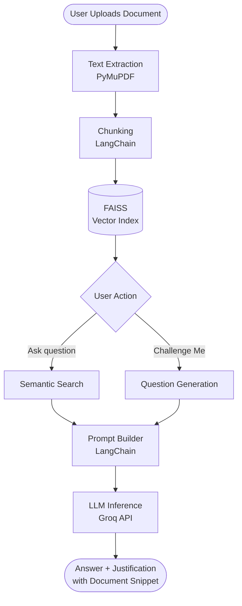

<div align="center">

# 🧠 SmartDoc-AI
### Smart Assistant for Research Documents


**SmartDoc-AI** goes beyond traditional summarizers — it reads, reasons, and challenges your understanding of any research document.

[🎥 Watch Demo](https://youtu.be/kzRCwWFEZGk) · [🐛 Report Bug](https://github.com/sangam962895/SummarAIze/issues) · [✨ Request Feature](https://github.com/sangam962895/SummarAIze/issues)

</div>

---

## 📌 Table of Contents

- [About](#-about)
- [Key Features](#-key-features)
- [Architecture](#-architecture)
- [Tech Stack](#-tech-stack)
- [Project Structure](#-project-structure)
- [Getting Started](#-getting-started)
- [Screenshots](#-screenshots)
- [Roadmap](#-roadmap)
- [Author](#-author)

---

## 🎯 About

Most document tools just search for keywords. **SmartDoc-AI** actually understands your content.

Built for researchers, students, and professionals who work with dense technical documents — it combines **Retrieval-Augmented Generation (RAG)**, semantic search, and fast LLM inference to deliver accurate, reference-backed answers with zero hallucinations.

> Every response is grounded in your document. No guessing. No made-up facts.

---

## ✨ Key Features

| Feature | Description |
|---|---|
| 📄 **Auto Summary** | Instant concise summary (≤ 150 words) of any uploaded document |
| 💬 **Ask Anything** | Natural language Q&A with answers cited directly from the document |
| 🧠 **Challenge Me** | AI generates logic-based questions and evaluates your reasoning — not just right/wrong, but *why* |
| 🔍 **Justified Answers** | Every response includes a source snippet or citation from the document |
| 🔁 **Context Memory** | Follow-up queries maintain conversation context |
| ⚡ **Fast Inference** | Powered by Groq API for near-instant responses |

---

## 🏗 Architecture



---

## 🧰 Tech Stack

| Technology | Role |
|---|---|
| **Streamlit** | Web-based frontend UI |
| **LangChain** | RAG orchestration and prompt engineering |
| **Groq API** | High-speed LLM inference — Mixtral / LLaMA |
| **FAISS** | Vector similarity search for document chunks |
| **PyMuPDF** | PDF parsing and text extraction |
| **FastAPI** | Backend API layer |

---

## 📁 Project Structure

```
SmartDoc-AI/
├── backend/
│   ├── vector_database.py      # FAISS indexing and embedding logic
│   └── rag_pipeline.py         # RAG chain setup and retrieval
├── frontend/
│   ├── streamlit_app.py        # Main app entry point
│   ├── summary.py              # Auto summary module
│   ├── ask_questions.py        # Ask Anything mode
│   └── self_eval.py            # Challenge Me mode
├── requirements.txt
└── .env                        # API keys (not committed)
```

---

## 🚀 Getting Started

### Prerequisites

- Python 3.10+
- A [Groq API key](https://console.groq.com/) (free tier available)

### Installation

**1. Clone the repository**
```bash
git clone https://github.com/sangam962895/SummarAIze.git
cd SummarAIze
```

**2. Create and activate a virtual environment**
```bash
python -m venv venv

# On macOS/Linux
source venv/bin/activate

# On Windows
venv\Scripts\activate
```

**3. Install dependencies**
```bash
pip install -r requirements.txt
```

**4. Set up environment variables**

Create a `.env` file in the root directory:
```env
GROQ_API_KEY=your_groq_api_key_here
```

**5. Run the app**
```bash
streamlit run frontend/streamlit_app.py
```

Open your browser at `http://localhost:8501` 🎉

---

## 📸 Screenshots

<details>
<summary>Click to expand</summary>

### Landing Page


### Auto Summary


### Ask Anything Mode


### Challenge Me — Questions


### Challenge Me — Reasoning Evaluation


### Challenge Me — Final Score


</details>

---

## 🗺 Roadmap

- [x] PDF and TXT document support
- [x] Auto summary generation
- [x] Natural language Q&A with citations
- [x] Challenge Me mode with reasoning evaluation
- [x] Context memory for follow-up queries
- [ ] Support for `.docx` and scanned OCR PDFs
- [ ] Voice input support
- [ ] Multi-language summaries
- [ ] Export Q&A logs to PDF or Markdown
- [ ] Conversation memory across sessions

---

## 👨‍💻 Author

**Sangam Kumar**

[](mailto:info.sangamgupta@gmail.com)
[](https://github.com/sangam962895)

---

<div align="center">
  <sub>© 2025 SmartDoc-AI — Read smarter. Learn deeper. 🚀</sub>
</div>
