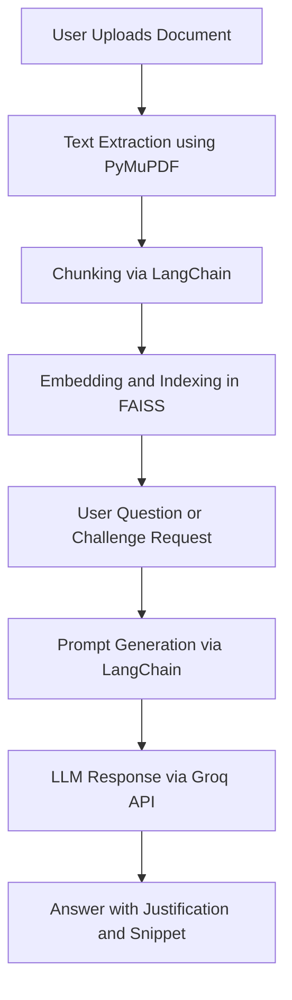

# 🧠 SmartDoc-AI: Smart Assistant for Research Documents

**SmartDoc-AI** is an AI-powered assistant that reads and reasons through your uploaded PDF or TXT documents. It delivers concise summaries, answers deep contextual questions, and challenges your understanding with logic-based evaluations. Designed for researchers, students, and professionals, SmartDoc AI bridges the gap between traditional summarizers and true comprehension — powered by **LangChain**, **FastAPI**, **Streamlit**, and **Groq API**.

---

## 🚀 Key Features

- 📄 **Document Upload**: Supports `.pdf` and `.txt` formats
- ✨ **Auto Summary**: Instantly generates a concise summary (≤ 150 words)
- 🤖 **Ask Anything Mode**: Natural language Q&A with grounded, source-based responses
- 🧠 **Challenge Me Mode**: Auto-generates logic-based questions and evaluates your answers
- 🔍 **Justified Answers**: Every response includes a citation or snippet from the document
- ⚡ **RAG Architecture**: Combines semantic search (FAISS) and fast inference (Groq API)
- 💡 **Bonus Capabilities**:
  - 🔁 Context memory for follow-up queries
  - 🎯 Highlighted text spans in answers for clarity

---
## 📁 Project Structure

```text
SmartDoc-AI/
├── backend/
│   ├── vector_database.py
│   └── rag_pipeline.py
├── frontend/
│   ├── streamlit_app.py
│   ├── summary.py
│   ├── ask_questions.py
│   └── self_eval.py
├── requirements.txt
└── .env
```
## 🧰 Tech Stack

| Technology       | Role                                             |
|------------------|--------------------------------------------------|
| **Streamlit**    | Web-based frontend UI                            |
| **LangChain**    | Orchestration of retrieval and LLM prompting     |
| **Groq API**     | High-speed inference using Mixtral or LLaMA      |
| **PyMuPDF**      | PDF parsing and text extraction                  |
| **FAISS**        | Vector similarity search for document chunks     |

---


## 🧠 Architecture Overview




---


## 🛠️ Setup Instructions

### 1. Clone the Repository

```bash
git clone https://github.com/sangam962895/SummarAIze.git
cd SummarAIze
```

### 2. Create a Virtual Environment

```bash
python -m venv venv
source venv/bin/activate  # For Windows: venv\Scripts\activate
```

### 3. Install Requirements

```bash
pip install -r requirements.txt
```

### 4. Configure Environment

Create a `.env` file and add your API key:

```env
GROQ_API_KEY=your_groq_api_key
```

### 5. Run the Application

```bash

# Start Streamlit frontend (in separate terminal)
streamlit run frontend/streamlit_app.py
```

---

## 📽 Demo Video

👉 [Watch the full demo on YouTube](https://youtu.be/kzRCwWFEZGk)

---

## 🌟 What Makes SmartDoc-AI Unique?

- ✅ Built specifically for long research and technical documents
- ✅ Uses RAG for accurate, reference-backed answers
- ✅ Provides comprehension-level challenge questions
- ✅ Fast response with Groq’s cutting-edge LLM support
- ✅ Modular architecture for easy customization and extension

---

## 🚧 Future Roadmap

- 📄 Support `.docx`, scanned OCR PDFs
- 🗣️ Voice input and multi-language summaries
- 💬 Conversation memory across sessions
- 📤 Export summaries and Q&A logs to PDF or Markdown

---

## 📝 Evaluation Alignment

| Criteria                          | Implementation Highlights                               |
|-----------------------------------|----------------------------------------------------------|
| ✔️ Accuracy + Justification       | Answers grounded in doc with citation                   |
| ✔️ Reasoning Mode                 | Auto Q&A + logic evaluation in "Challenge Me" mode      |
| ✔️ Clean UI/UX                    | Streamlit interface with minimal friction               |
| ✔️ Code Quality                   | Modular FastAPI + frontend/backend separation           |
| ✔️ Bonus Features                 | Memory + snippet highlighting support                   |
| ✔️ Contextual Awareness           | Uses FAISS and LangChain to maintain document context   |

## 📸 Screenshots
  **Landing Page**
  
  <

  **Summary**
  


  
  **Ask Question**
  


  
  **Self Evaluation Quiz**
  
  

  
  **Evaluation of Quiz Reasoning**

  

  
  **Self Evaluation Score**

  


**👨‍💻 Sangam Kumar**  

 Email: [info.sangamgupta@gmail.com](mailto:info.sangamgupta@gmail.com)  
 
GitHub: [sangam962895](https://github.com/sangam962895)

© 2025 — Smart Assistant Project

SmartDoc-AI smarter. Learn deeper. 🚀
